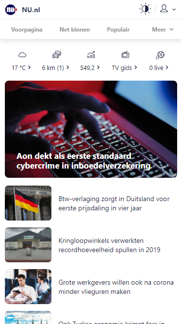
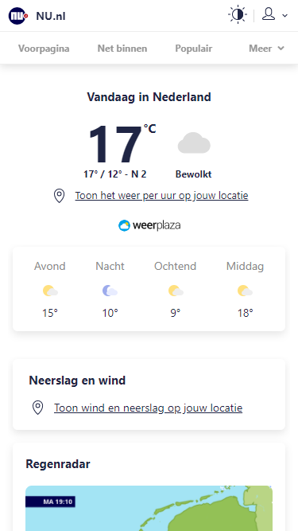

# Procesverslag
**Auteur:** -Jort Broekhof-

[Website](https://jortdus.github.io/intake/)

## Bronnenlijst
1. [nu.nl](https://www.nu.nl)

## Eindgesprek (week 7/8)

//

**Screenshot(s):**

## Voortgang 3 (week 6)

//

## Voortgang 2 (week 5)

//

## Voortgang 1 (week 3)
Ik heb Sanne gevraagt te kijken naar de semantische correctheid van mijn code op dat moment. 
Ik had op een bepaalde section te veel elementen toegepast en heb de code daar zelf beter kunnen neerzetten na deze feedback.
### Stand van zaken

//

**Screenshot(s):**

//

## Intake (week 1)

**Je startniveau:** Zwart

**Je focus:** Responsive, ik ben bekend met web development (Diploma webdevelopment) en wil me dus focusen om mijn responsive development skills te verbeteren en nog netter te maken. 

**Je opdracht:** [nu.nl](https://www.nu.nl)

**Screenshot(s):**

**Breakdown-schets(en):**

(images/breakdownschets.png)